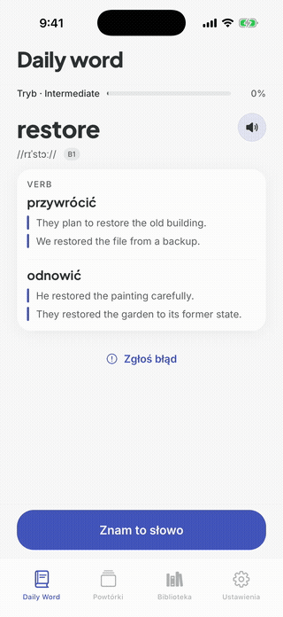
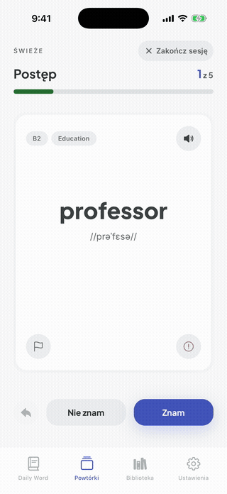
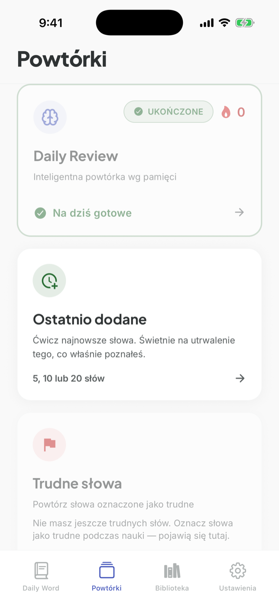
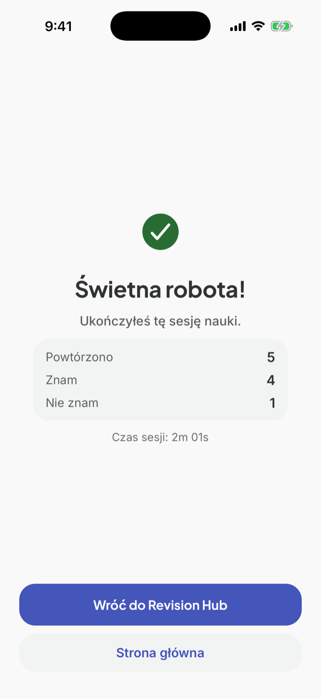
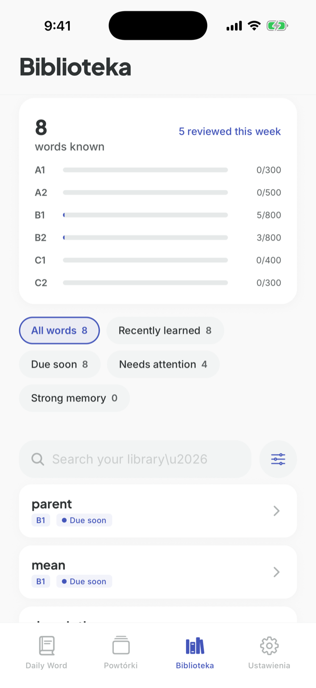
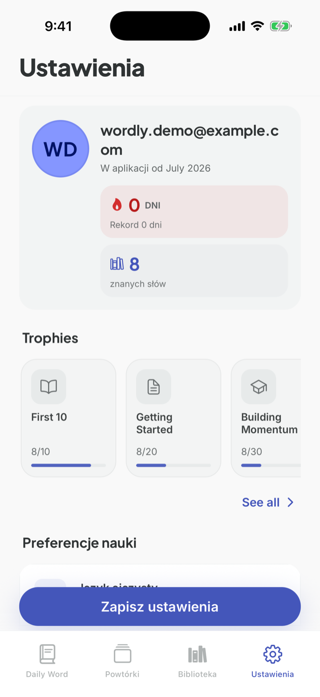
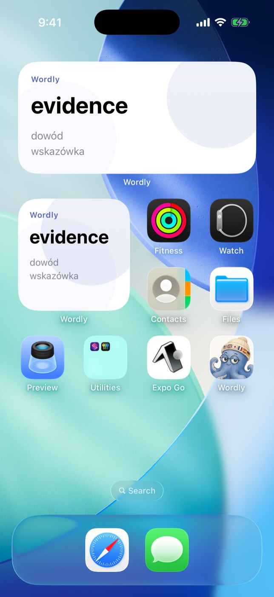

<p align="center">
  
</p>

<h1 align="center">Wordly</h1>

<p align="center">
  Learn languages one word at a time.<br />
  A daily word, smart flashcard reviews and a native iOS widget.
</p>

<p align="center">
  <em>React Native · Expo · TypeScript · Supabase · SwiftUI (WidgetKit)</em>
</p>

---

## The idea

No overwhelming word lists. Wordly gives you one new word a day, matched to your level, and brings it back with spaced repetition exactly when you are about to forget it. A home screen widget keeps the word in front of you all day.

The catalog has 4000+ English words with Polish translations, IPA and example sentences, generated and validated by an LLM pipeline. The interface is available in English and Polish.

## Onboarding

<table>
  <tr>
    <td width="62%">
      <h4>Pick your languages and how you want to learn</h4>
      <p>Sign in with Google, choose your native and learning language and pick a mode. You can learn by CEFR difficulty (Beginner, Intermediate, Advanced, each showing a live word count) or focus on one category like business, travel or law. The last step shows how the home screen widget turns unlocking your phone into a micro lesson.</p>
    </td>
    <td width="38%" align="center">
      
    </td>
  </tr>
</table>

## Daily word

<table>
  <tr>
    <td width="38%" align="center">
      
    </td>
    <td width="62%">
      <h4>One word a day, properly explained</h4>
      <p>Every day you get one word picked for your level, with pronunciation (IPA and text to speech), all senses and real example sentences. Know it already? Tap "I know this word" and the next one appears. The progress bar at the top shows how far you are in your track.</p>
    </td>
  </tr>
</table>

## Reviews

<table>
  <tr>
    <td width="62%">
      <h4>Flashcards that come back at the right moment</h4>
      <p>The Revision Hub offers three kinds of sessions. Daily Review is driven by a spaced repetition algorithm, Recently added drills your newest words and Difficult words collects the ones you keep missing. Each card flips to reveal the translation and examples, you answer "I know" or "I don't know" and the schedule adjusts. A summary closes every session.</p>
    </td>
    <td width="38%" align="center">
      
    </td>
  </tr>
</table>

<p align="center">
  
  &nbsp;&nbsp;
  
</p>

## Library

<table>
  <tr>
    <td width="38%" align="center">
      
    </td>
    <td width="62%">
      <h4>Your whole vocabulary in one place</h4>
      <p>The Library shows every word you know with progress bars per CEFR level, from A1 to C2. You can search, or filter by memory state: recently learned, due soon, needs attention, strong memory. Tapping a word opens its full page with senses, examples and audio.</p>
    </td>
  </tr>
</table>

## Profile and trophies

<table>
  <tr>
    <td width="62%">
      <h4>Small wins that keep the habit alive</h4>
      <p>A daily streak, a known words counter and a set of trophies with progress toward the next one. Learning preferences can be changed here at any time, including languages, level and the interface language.</p>
    </td>
    <td width="38%" align="center">
      
    </td>
  </tr>
</table>

## iOS widget

<table>
  <tr>
    <td width="38%" align="center">
      
    </td>
    <td width="62%">
      <h4>The word waits on your home screen</h4>
      <p>A native SwiftUI widget shows the daily word and its translation right on the home screen and lock screen, no need to open the app. It is fed through a custom native bridge and taps deep link straight into app actions.</p>
    </td>
  </tr>
</table>

## Under the hood

- **React Native + Expo (Expo Router)**, TypeScript, feature-based architecture
- **Supabase Postgres** with the whole learning logic (word selection, SRS, stats) in SQL functions behind row level security
- **Offline first**: TanStack Query with local persistence and connectivity-aware UI
- **Native iOS widget** in SwiftUI, fed by a custom JS to native bridge with deep links back into the app
- **LLM content pipeline** that generates, validates and imports the vocabulary in batches

## Run it

```bash
npm install
cp .env.example .env   # Supabase keys
npm run start
```

---

<p align="center">
  Built by <a href="https://github.com/damianmichalowski">Damian Michałowski</a>
</p>
